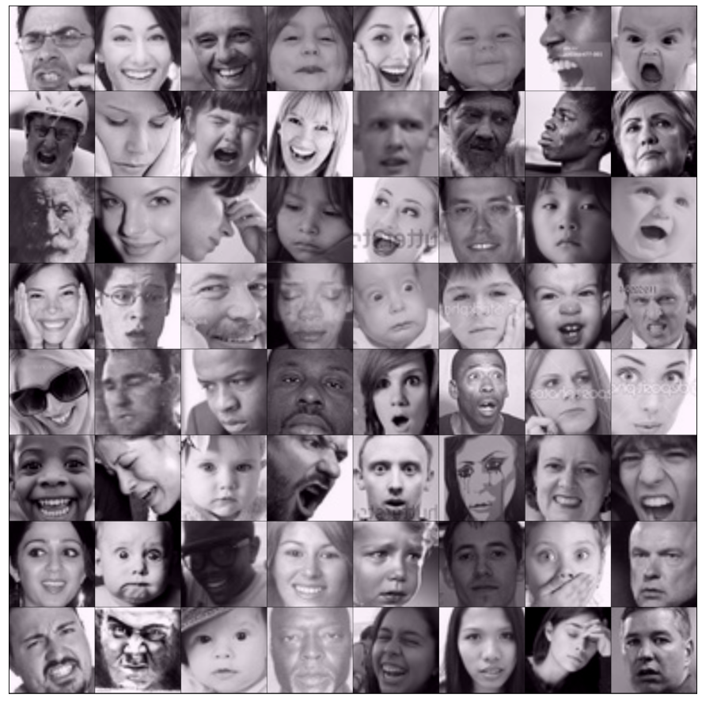

# Facial Expression Recognition & Comparative Study on Densenet161 and Resnet152 using Deep Learning, PyTorch, and Transfer Learning

Facial Expression Recognition can be featured as one of the classification jobs people might like to include in the set of computer vision. The job of our project will be to look through a camera that will be used as eyes for the machine and classify the face of the person (if any) based on his current expression/mood.

Face recognition is a method of identifying or verifying the identity of an individual using their face. It is one of the most important computer vision applications with great commercial interest. Recently, face recognition technologies greatly advanced with deep learning-based methods.

Face recognition in static images and video sequences, captured in unconstrained recording conditions, is one of the most widely studied topics in computer vision due to its extensive range of applications in surveillance, law enforcement, bio-metrics, marketing, and many more.

DATASET
------
https://www.kaggle.com/apollo2506/facial-recognition-dataset

Pretrained Model
-----

**DenseNet161**

Recent work has shown that convolutional networks can be substantially deeper, more accurate, and efficient to train if they contain shorter connections between layers close to the input and those close to the output. In this paper, we embrace this observation and introduce the Dense Convolutional Network (DenseNet), which connects each layer to every other layer in a feed-forward fashion. Whereas traditional convolutional networks with L layers have L connections - one between each layer and its subsequent layer - our network has L(L+1)/2 direct connections. For each layer, the feature maps of all preceding layers are used as inputs, and their own feature maps are used as inputs into all subsequent layers. DenseNets have several compelling advantages: they alleviate the vanishing gradient problem, strengthen feature propagation, encourage feature reuse, and substantially reduce the number of parameters. We evaluate our proposed architecture on four highly competitive object recognition benchmark tasks (CIFAR-10, CIFAR-100, SVHN, and ImageNet). DenseNets obtain significant improvements over the state-of-the-art on most of them, whilst requiring less memory and computation to achieve high performance. 
Authors: Gao Huang, Zhuang Liu, Kilian Q. Weinberger, Laurens van der Maaten

    
  

    
  

  
**ResNet152**

Deeper neural networks are more difficult to train. We present a residual learning framework to ease the training of networks that are substantially deeper than those used previously. We explicitly reformulate the layers as learning residual functions concerning the layer inputs, instead of learning unreferenced functions. We provide comprehensive empirical evidence showing that these residual networks are easier to optimize, and can gain accuracy from considerably increased depth. On the ImageNet dataset, we evaluate residual nets with a depth of up to 152 layers - -8x deeper than VGG nets but still having lower complexity.
An ensemble of these residual nets achieves a 3.57% error on the ImageNet test set. This result won 1st place on the ILSVRC 2015 classification task. We also present an analysis on CIFAR-10 with 100 and 1000 layers.
The depth of representations is of central importance for many visual recognition tasks. Solely due to our extremely deep representations, we obtain a 28% relative improvement on the COCO object detection dataset. Deep residual nets are the foundations of our submissions to ILSVRC & COCO 2015 competitions, where we also won 1st place on the tasks of ImageNet detection, ImageNet localization, COCO detection, and COCO segmentation.
Authors: Kaiming He, Xiangyu Zhang, Shaoqing Ren, Jian Sun

    
  

  
  Transfer Learning:
  ------
 The basic premise of transfer learning is simple: take a model trained on a large dataset and transfer its knowledge to a smaller dataset. For object recognition with a CNN, we freeze the early convolutional layers of the network and only train the last few layers which make a prediction. The idea is the convolutional layers extract general, low-level features that are applicable across images - such as edges, patterns, gradients - and the later layers identify specific features within an image such as eyes or wheels.
 
 

    
  

  
Results:
-----
**Resnet152:**

 

    
  

  
   

    
  

  
  From the epoch vs loss graph, we can see that firstly both the training data and testing data are decreasing simultaneously up to epoch 15. After that, the training plotline started increasing for some time while the validation plotline is going parallel.
Initially, both the training and validation losses seem to decrease over time. However, if you train the model for long enough, you will notice that the training loss continues to decrease, while the validation loss stops decreasing, and even starts to increase after a certain point!

   

    
  

  
  This phenomenon is called overfitting, and it is the no. 1 why many machine learning models give rather terrible results on real-world data. It happens because the model, in an attempt to minimize the loss, starts to learn patterns that are unique to the training data, sometimes even memorizing specific training examples. Because of this, the model does not generalize well to previously unseen data.
  
   

    
  

  **Densenet161:**
  
   

    
  

   

    
  

From the epoch vs loss graph, we can see that firstly both the training data and testing data are decreasing simultaneously up to epoch 5. After that, the training plotline started increasing for some time while the validation plotline is going parallelly.

Conclusion:
-----
1. Training for Facial expression recognition was much more difficult than I thought it would be, some expressions are fairly similar and it seems to create more error when trying to recognize certain expressions.

2. Maybe a bigger size picture Resize and Randomcrop can give a better result, but for that top quality, GPU is highly required otherwise it will give an "out of memory" error.

3. I also tried different learning rates and other approaches. Also tried DenseNet, but ResNet was better.

Blog:
----

Check out my Medium article ,where I have explained in detail.

[Blog Link](https://nandisoham2017.medium.com/stock-market-analysis-and-forecasting-using-deep-learning-f75052e81301)

THANK YOU :
-----
